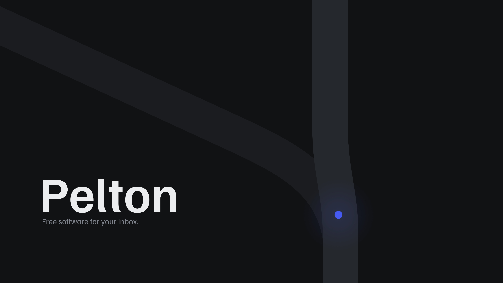
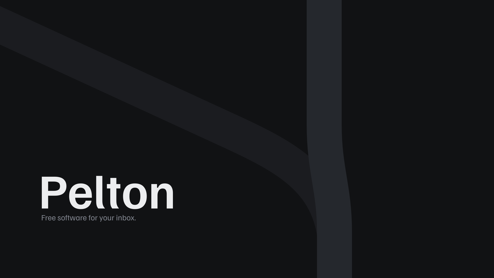
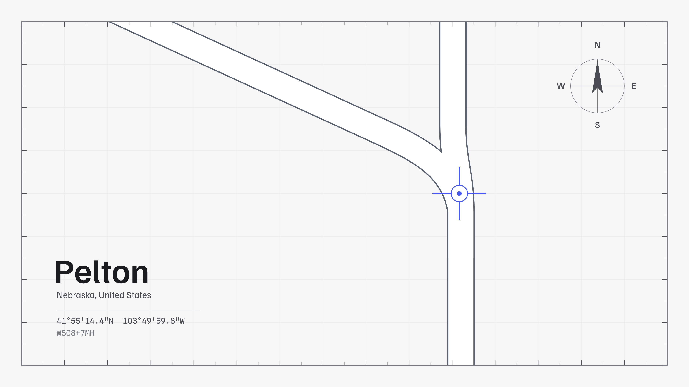
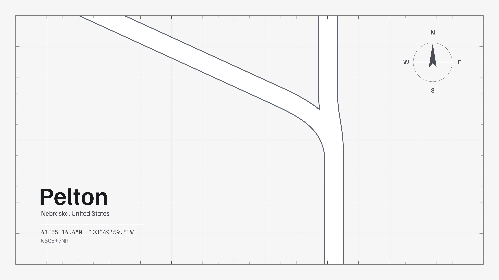

# Gallery

Every wallpaper in this repo. Previews are JPEG, downloads are available
as PNG, JPEG and SVG.

<!-- This file is generated by scripts/generate_gallery.py. Do not edit by hand. -->

## Night

<table>
<tr>
<td width="50%" valign="top" align="center"> <b>1 / Default</b> Author: Arne K. (TRC-Loop) <a href="wallpapers/night/1/default/night-1-default-3840x2160.png?raw=1">PNG</a> | <a href="wallpapers/night/1/default/night-1-default-3840x2160.jpg?raw=1">JPEG</a> | <a href="wallpapers/night/1/default/night-1-default.svg?raw=1">SVG</a></td>
<td width="50%" valign="top" align="center"> <b>1 / No Marker</b> Author: Arne K. (TRC-Loop) <a href="wallpapers/night/1/no-marker/night-1-no-marker-3840x2160.png?raw=1">PNG</a> | <a href="wallpapers/night/1/no-marker/night-1-no-marker-3840x2160.jpg?raw=1">JPEG</a> | <a href="wallpapers/night/1/no-marker/night-1-no-marker.svg?raw=1">SVG</a></td>
</tr>
</table>

## Plate

<table>
<tr>
<td width="50%" valign="top" align="center"> <b>1 / Default</b> Author: Arne K. (TRC-Loop) <a href="wallpapers/plate/1/default/plate-1-default-3840x2160.png?raw=1">PNG</a> | <a href="wallpapers/plate/1/default/plate-1-default-3840x2160.jpg?raw=1">JPEG</a> | <a href="wallpapers/plate/1/default/plate-1-default.svg?raw=1">SVG</a></td>
<td width="50%" valign="top" align="center"> <b>1 / No Marker</b> Author: Arne K. (TRC-Loop) <a href="wallpapers/plate/1/no-marker/plate-1-no-marker-3840x2160.png?raw=1">PNG</a> | <a href="wallpapers/plate/1/no-marker/plate-1-no-marker-3840x2160.jpg?raw=1">JPEG</a> | <a href="wallpapers/plate/1/no-marker/plate-1-no-marker.svg?raw=1">SVG</a></td>
</tr>
<tr>
<td width="50%" valign="top" align="center"> <b>1 / No Marker No Compass</b> Author: Arne K. (TRC-Loop) <a href="wallpapers/plate/1/no-marker-no-compass/plate-1-no-marker-no-compass-3840x2160.png?raw=1">PNG</a> | <a href="wallpapers/plate/1/no-marker-no-compass/plate-1-no-marker-no-compass-3840x2160.jpg?raw=1">JPEG</a> | <a href="wallpapers/plate/1/no-marker-no-compass/plate-1-no-marker-no-compass.svg?raw=1">SVG</a></td>
<td></td>
</tr>
</table>
