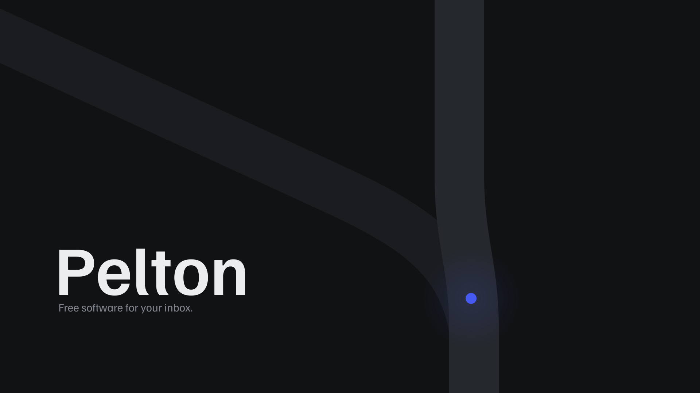
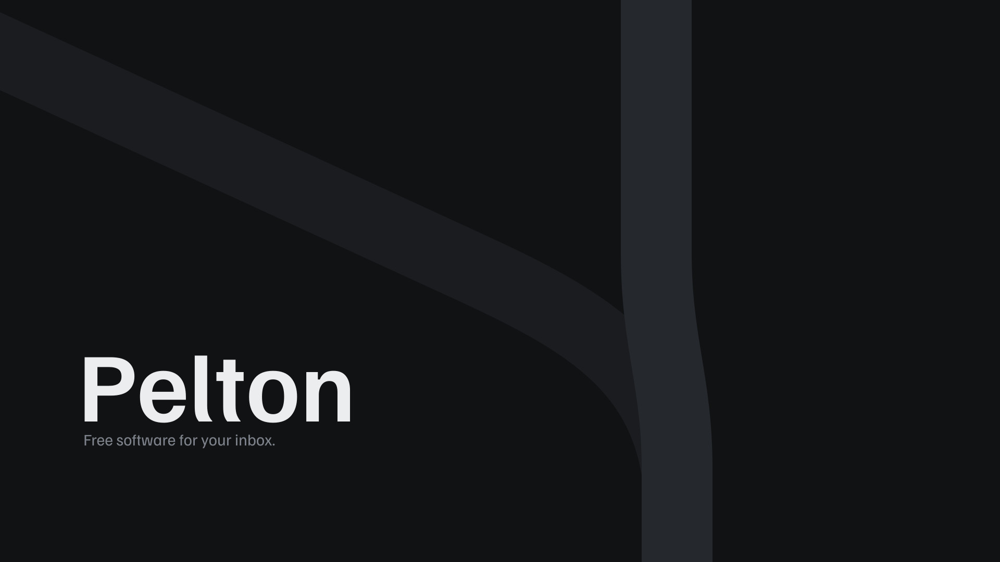
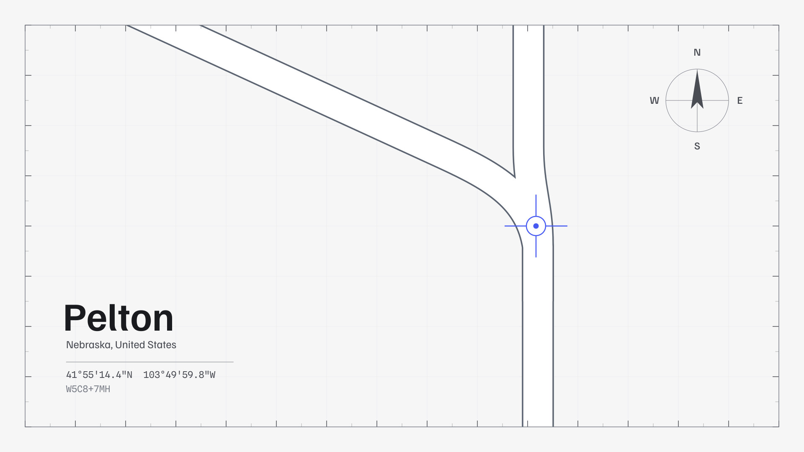
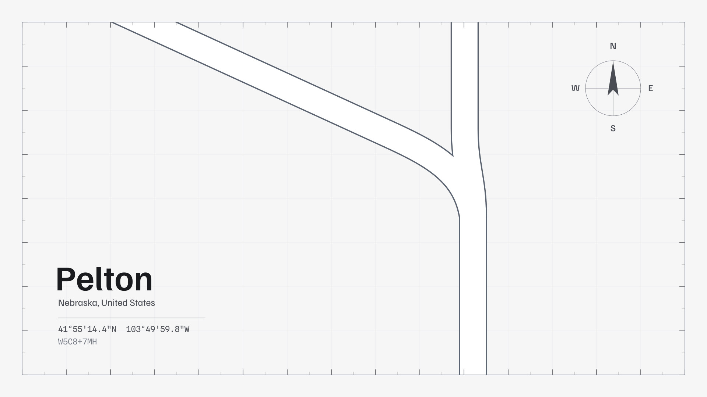

# Pelton Wallpapers

Official desktop and mobile wallpapers for **[Pelton](https://pelton.app)**

## Usage

Pick a wallpaper from the gallery below, download the format you want, and set
it as your background. That's it.

- **JPEG** for everyday use, smallest file
- **PNG** for lossless quality
- **SVG** to scale to any resolution or edit it yourself

Desktop wallpapers come in 3840x2160, 2560x1440 and 1920x1080. Building
something on top of these? [`wallpapers.json`](./wallpapers.json) lists every
wallpaper with its formats, resolutions and authors.

More of the Pelton look lives at [pelton.app/design](https://pelton.app/design).

## Contributing

New art is welcome. See [CONTRIBUTING.md](./CONTRIBUTING.md) for the folder
layout, naming rules and how the gallery is generated.

## Gallery

<!-- gallery:start -->

<!-- Generated by scripts/generate_gallery.py. Do not edit this section by hand. -->

### Desktop

<table>
<tr>
<td width="50%" valign="top" align="center"> <b>Night / 1 / Default</b> Author: github-actions[bot] 3840x2160: <a href="wallpapers/desktop/night/1/default/night-1-default-3840x2160.png?raw=1">PNG</a> | <a href="wallpapers/desktop/night/1/default/night-1-default-3840x2160.jpg?raw=1">JPEG</a> 2560x1440: <a href="wallpapers/desktop/night/1/default/night-1-default-2560x1440.png?raw=1">PNG</a> | <a href="wallpapers/desktop/night/1/default/night-1-default-2560x1440.jpg?raw=1">JPEG</a> 1920x1080: <a href="wallpapers/desktop/night/1/default/night-1-default-1920x1080.png?raw=1">PNG</a> | <a href="wallpapers/desktop/night/1/default/night-1-default-1920x1080.jpg?raw=1">JPEG</a> Vector: <a href="wallpapers/desktop/night/1/default/night-1-default.svg?raw=1">SVG</a></td>
<td width="50%" valign="top" align="center"> <b>Night / 1 / No Marker</b> Author: Arne K. (TRC-Loop) 3840x2160: <a href="wallpapers/desktop/night/1/no-marker/night-1-no-marker-3840x2160.png?raw=1">PNG</a> | <a href="wallpapers/desktop/night/1/no-marker/night-1-no-marker-3840x2160.jpg?raw=1">JPEG</a> 2560x1440: <a href="wallpapers/desktop/night/1/no-marker/night-1-no-marker-2560x1440.png?raw=1">PNG</a> | <a href="wallpapers/desktop/night/1/no-marker/night-1-no-marker-2560x1440.jpg?raw=1">JPEG</a> 1920x1080: <a href="wallpapers/desktop/night/1/no-marker/night-1-no-marker-1920x1080.png?raw=1">PNG</a> | <a href="wallpapers/desktop/night/1/no-marker/night-1-no-marker-1920x1080.jpg?raw=1">JPEG</a> Vector: <a href="wallpapers/desktop/night/1/no-marker/night-1-no-marker.svg?raw=1">SVG</a></td>
</tr>
<tr>
<td width="50%" valign="top" align="center"> <b>Plate / 1 / Default</b> Author: Arne K. (TRC-Loop) 3840x2160: <a href="wallpapers/desktop/plate/1/default/plate-1-default-3840x2160.png?raw=1">PNG</a> | <a href="wallpapers/desktop/plate/1/default/plate-1-default-3840x2160.jpg?raw=1">JPEG</a> 2560x1440: <a href="wallpapers/desktop/plate/1/default/plate-1-default-2560x1440.png?raw=1">PNG</a> | <a href="wallpapers/desktop/plate/1/default/plate-1-default-2560x1440.jpg?raw=1">JPEG</a> 1920x1080: <a href="wallpapers/desktop/plate/1/default/plate-1-default-1920x1080.png?raw=1">PNG</a> | <a href="wallpapers/desktop/plate/1/default/plate-1-default-1920x1080.jpg?raw=1">JPEG</a> Vector: <a href="wallpapers/desktop/plate/1/default/plate-1-default.svg?raw=1">SVG</a></td>
<td width="50%" valign="top" align="center"> <b>Plate / 1 / No Marker</b> Author: Arne K. (TRC-Loop) 3840x2160: <a href="wallpapers/desktop/plate/1/no-marker/plate-1-no-marker-3840x2160.png?raw=1">PNG</a> | <a href="wallpapers/desktop/plate/1/no-marker/plate-1-no-marker-3840x2160.jpg?raw=1">JPEG</a> 2560x1440: <a href="wallpapers/desktop/plate/1/no-marker/plate-1-no-marker-2560x1440.png?raw=1">PNG</a> | <a href="wallpapers/desktop/plate/1/no-marker/plate-1-no-marker-2560x1440.jpg?raw=1">JPEG</a> 1920x1080: <a href="wallpapers/desktop/plate/1/no-marker/plate-1-no-marker-1920x1080.png?raw=1">PNG</a> | <a href="wallpapers/desktop/plate/1/no-marker/plate-1-no-marker-1920x1080.jpg?raw=1">JPEG</a> Vector: <a href="wallpapers/desktop/plate/1/no-marker/plate-1-no-marker.svg?raw=1">SVG</a></td>
</tr>
<tr>
<td width="50%" valign="top" align="center"> <b>Plate / 1 / No Marker No Compass</b> Author: Arne K. (TRC-Loop) 3840x2160: <a href="wallpapers/desktop/plate/1/no-marker-no-compass/plate-1-no-marker-no-compass-3840x2160.png?raw=1">PNG</a> | <a href="wallpapers/desktop/plate/1/no-marker-no-compass/plate-1-no-marker-no-compass-3840x2160.jpg?raw=1">JPEG</a> 2560x1440: <a href="wallpapers/desktop/plate/1/no-marker-no-compass/plate-1-no-marker-no-compass-2560x1440.png?raw=1">PNG</a> | <a href="wallpapers/desktop/plate/1/no-marker-no-compass/plate-1-no-marker-no-compass-2560x1440.jpg?raw=1">JPEG</a> 1920x1080: <a href="wallpapers/desktop/plate/1/no-marker-no-compass/plate-1-no-marker-no-compass-1920x1080.png?raw=1">PNG</a> | <a href="wallpapers/desktop/plate/1/no-marker-no-compass/plate-1-no-marker-no-compass-1920x1080.jpg?raw=1">JPEG</a> Vector: <a href="wallpapers/desktop/plate/1/no-marker-no-compass/plate-1-no-marker-no-compass.svg?raw=1">SVG</a></td>
<td></td>
</tr>
</table>

### Mobile

*Nothing here yet.*

<!-- gallery:end -->

## License

Copyright (c) 2026 Arne K. (https://github.com/TRC-Loop)

This work is licensed under the Creative Commons Attribution 4.0 International
License. To view a copy of this license, visit
https://creativecommons.org/licenses/by/4.0/

See [LICENSE](./LICENSE) for the full text.
